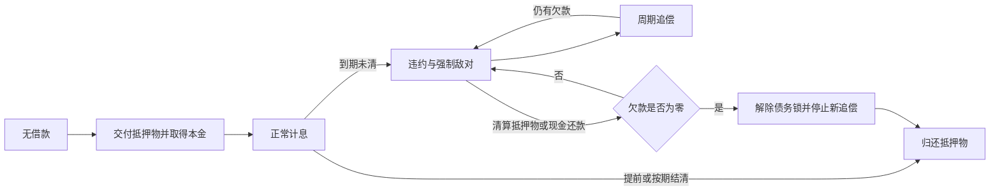
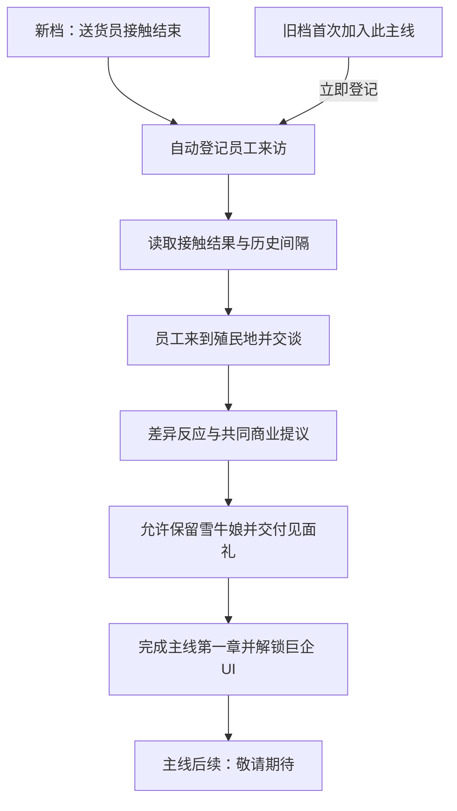
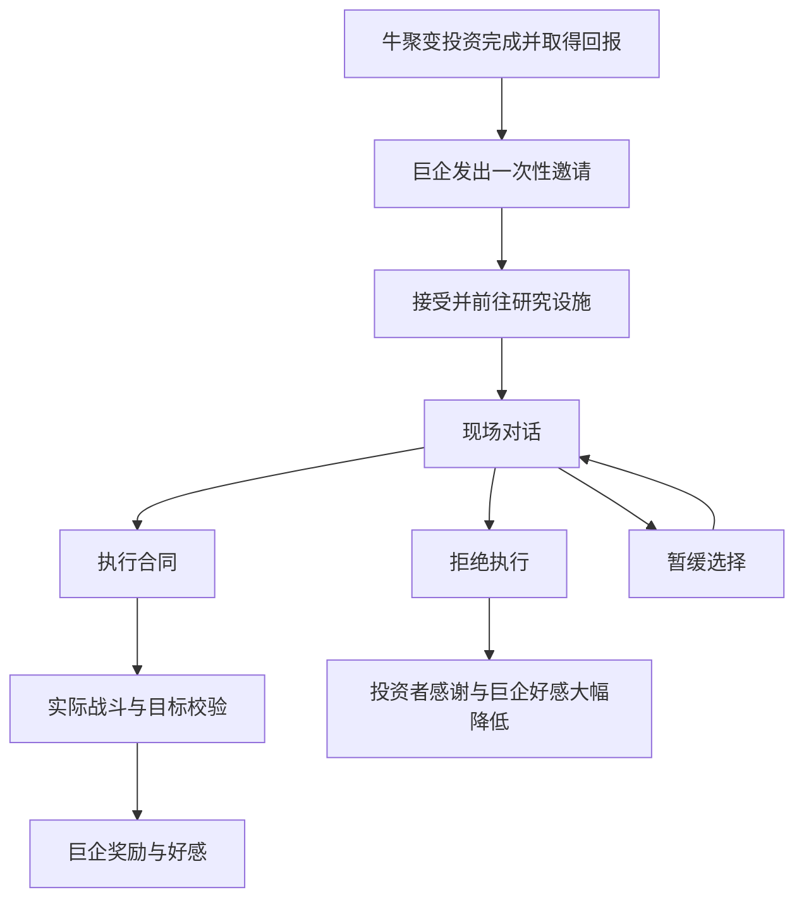

# 巨企通讯与业务系统设计方案

## 文档状态

- 日期：2026-09-16。
- 适用版本：RimWorld 1.6。
- 状态：首版已实现并通过整合验证。本文保留完整玩法设计；实际覆盖范围、运行结果与限制见 [首版验证记录](giant-corporation-v1-validation.md)。
- 范围：解锁终端的巨企员工来访主线、巨企通讯 UI、物资交易、雪牛娘交易、抵押贷款、每周轮换的日常任务，以及“肃清·牛聚变投资者”支线。
- 主线第一章在送货员接触任务后自动触发；完成来访后解锁巨企 UI。中途加入旧档立即安排来访，主线后续显示“敬请期待”。
- 文中数值作为首轮配置基线，实际报价和条款以当前 Def 与签约界面为准；尚未经过长期平衡测试。标为可选的后续内容不代表首版已包含。

## 1. 设计目标与需求解释

巨企提供一个长期存在、物资丰富、办事高效但唯利是图的商业渠道。玩家可以用它解决资源、劳动力和资金短缺，也需要面对奴隶交易的道德代价、委托中的利益冲突，以及逾期贷款的武力追偿。

界面采用白色科幻企业终端风格。表面克制、整洁、专业，合同和对白逐渐显露巨企对生命、产权与收益的态度。正常业务页以信息和操作为主，讽刺性文案用于合同、客服和剧情对白。

| 用户需求 | 本文对应设计 |
| --- | --- |
| 通讯台选择、巨企据点进入同一个 UI | 两个实体入口，共用同一账户、库存和合同状态 |
| 员工来访主线完成后解锁 UI | 送货员接触后自动来访；不追究杀害或放走送货员，允许保留雪牛娘并送见面礼 |
| 中途加入旧档立即触发，久别对白变化 | 独立迁移入口，不等待旧事件重跑；按历史证据和间隔选择对白 |
| 高价收购雪牛娘奶、毛及其制品 | 独立产品收购页，按实际货物估值，支持原料、材料制品及记录了原料的食品 |
| 常驻物资每周轮换、数量有限、只买不卖 | 全局周库存，购买扣库存；普通物资不提供出售入口 |
| 稀有物资订单，几乎什么都能买 | 广泛的可订购物品目录、更高报价、备货时间、保存后的订单状态 |
| 高价收购雪牛娘，计为奴隶贸易并额外减心情 | 保留原版交易后果，新增“送去了黑心企业”记忆 |
| 每周展出数名雪牛娘，购入后为奴隶 | 保存具体 Pawn 的周展览，展示能力与状态；奴隶加入依赖 Ideology |
| 高息抵押、还不上持续袭击并锁定敌对 | 实物抵押、明示计息、逾期追偿、还清才解除债务敌对锁 |
| 日常任务每周轮换 | 未接委托按周刷新；已接委托遵守各自期限 |
| 牛聚变投资完成后的肃清支线 | 前置结算后一次性解锁，到场对话后选择执行或拒绝 |

术语约定：

- “一周”统一为 **7 个游戏日，即 420,000 ticks**，不等同于游戏中的一个象限季。
- “日常任务”是业务分类名称，本轮刷新周期仍为每周，不额外每天刷新。
- 原需求中订单的价格与时间表述，本文按“**比普通轨道商人更贵，而且需要更久备货**”解释。
- “几乎什么都能买到”指通常能作为货物交付的物品；任务专用对象、活体、货币和需要专门生成流程的内容分别处理，不直接对所有 ThingDef 强行生成。

## 2. 通讯入口与访问规则

两个业务入口均以主线第一章完成为解锁条件。未解锁时只显示“尚未建立商业联系”的提示，不能打开完整业务 UI；首次主线通过员工实体来访和原版任务/信件交互开展，不依赖尚未开放的终端。

### 2.1 通讯台

在殖民者操作通讯台的菜单中新增“联系巨企商业网络”。角色需要像正常通讯一样走到通讯台、完成预留并满足可操作条件，然后打开终端。

- 检查角色存活、可行动、可交流、未失去操作资格，以及通讯台可达、可用、供电正常。
- 交易货物与白银来自本地图有效贸易信标覆盖的可交易物品。页面明确显示此范围，避免把全殖民地资源数误当成可支付数量。
- 人员候选单独读取殖民地中可合法出售的人口；不要求人站在贸易信标内。
- 界面打开时暂停游戏；关闭后恢复之前的暂停状态。
- 每次确认业务仍复查角色、通讯台、货物和余额。窗口留存本身不构成永久访问权限。
- 地图接收普通货物和购入人员时使用贸易空投逻辑；交货目标为当前业务绑定的地图。

### 2.2 巨企据点

玩家远行队到达巨企据点所在世界格后，显示“进入巨企商业终端”指令。直接打开相同 UI，无需生成据点内部地图。

- 交易上下文为当前远行队，读取其物品和人员。
- 到场交易无需殖民地通讯台、供电或贸易信标。
- 玩家只在世界地图选中远处巨企据点时，可看到进入条件提示；不能跨地图直接交易。
- 购入货物进入远行队库存，人员加入该远行队；确认前显示新增重量与可能的超载状态。
- 多支远行队、多张殖民地地图看到相同的巨企库存与账户。

### 2.3 关系与限制

| 当前状态 | 终端行为 |
| --- | --- |
| 员工来访主线未完成 | 通讯台和据点均提示尚未建立商业联系；主线进度从原版任务列表查看 |
| 非敌对，账户正常 | 开放普通业务 |
| 因剧情或其他原因敌对 | 允许查看账户与偿债；暂停新的普通交易和委托 |
| 贷款违约 | 显示追偿横幅；保留还款、抵押物处置及已产生应收款的结算入口；暂停新借款和新合同 |
| 巨企派系不存在或已灭亡 | 给出明确原因；保留历史合同查看与异常订单处理，不凭空重建派系 |
| 地图或远行队失效 | 关闭可执行操作；待选择有效交付地点后继续处理可恢复业务 |

已经付款的订单、已经完成的任务奖励属于应履行合同。敌对不抹除这些记录，也不允许它们通过普通“购买”操作重复生成。

## 3. 白色科幻 UI

### 3.1 参考范围

参考用户指定模组中的 `MRK_ALG_UniversalTradeHub` 模块，重点借鉴完整终端的页面分区、列表与详情联动、固定位置操作和业务状态表达。

已阅读该模块 `Source` 下的 `UTHStoreWindow.cs`、`UTHStoreHome.cs`、`UTHStoreCatalog.cs` 和 `UTHStoreUI.cs`：其宿主窗口统一页面框架，目录页按宽度调整分类、货物与订单布局，样式由公共 UI 工具集中管理。巨企终端沿用这些组织思路，并重新设计白色配色、企业标识和业务页面。参考模块的隔离 IMGUI 预览仅用于视觉研究，不视为巨企终端已完成的游戏截图。

首版采用本模组自己的白色企业主题与内容结构。参考模组仅用于研究，不成为运行依赖；关闭或未安装该模组时，巨企终端仍可正常工作。真实游戏中的八个业务页已分别在 1920×1080 和 1280×720、100% UI 缩放下检查；截图位置见首版验证记录。

### 3.2 视觉语言

| 用途 | 建议颜色 | 使用方式 |
| --- | --- | --- |
| 窗口背景 | `#F3F6FA` | 冷白底，减少纯白大面积刺眼 |
| 主面板 | `#FFFFFF` | 列表、详情卡和合同正文 |
| 次级面板 | `#EAF0F6` | 导航、摘要与只读区域 |
| 主文字 | `#203348` | 标题与正文，白底上保持清晰 |
| 次级文字 | `#566B80` | 时间、库存、辅助说明 |
| 品牌强调 | `#087C91` | 当前导航、主要操作、关键金额 |
| 细分隔线 | `#CEDAE5` | 卡片边界、表格分隔 |
| 警告 | `#875B0B` | 即将到期、风险提示，并配图标/文字 |
| 危险 | `#B73A49` | 违约、失败和不可逆操作 |

- 采用清晰的矩形面板、细边框、适量留白与小型状态徽标。
- 使用“巨企 / 商业网络”标识及简洁几何企业图形；不依赖大面积装饰贴图。
- 红色主要用于真实风险，日常业务保持冷静的蓝灰与青色。
- 不用闪烁、跑马灯或持续动画来传达重要状态。
- 状态必须有文字，不能只依赖颜色。
- 所有页使用一致的金额、数量、日期和确认按钮位置。

### 3.3 页面骨架

```text
┌ 巨企 / 商业网络 ─────────────── 账户状态 · 下次轮换 · 关闭 ┐
│                    │                                      │
│ 业务总览           │ 页面标题                可用白银     │
│ 物资交易           │ 简短业务说明                         │
│   产品收购         ├─────────────────────┬────────────────┤
│   常驻物资         │ 搜索 / 分类 / 排序  │ 详情与报价     │
│   物资订单         │                     │                │
│ 雪牛娘交易         │ 物品 / 人员 / 合同  │ 数量与条件     │
│ 贷款与抵押         │ 列表                │ 交货地点       │
│ 委托中心           │                     │ 到期 / 风险    │
│   日常 / 支线 / 主线│                     │                │
│ 合同记录           │                     │                │
├────────────────────┴─────────────────────┴────────────────┤
│ 当前地点 · 货物范围             本次合计       确认操作     │
└───────────────────────────────────────────────────────────┘
```

布局规则：

- 默认窗口约 1120 × 760，按实际可用屏幕与 UI 缩放收缩；不能超出屏幕。
- 以左侧导航、中央列表、右侧详情为主；窄窗口中详情移到列表下方，不压缩到无法读数。
- 页面分别保存搜索词、筛选和滚动位置；切换页面不丢弃已输入的有效数据。
- 业务总览显示本周库存摘要、待交货订单、即将到期合同、贷款余额和可领取奖励。
- 人员展示使用头像、姓名、年龄、技能、特性、健康与关系摘要；提供标准信息卡入口。
- 主线页展示已完成的员工来访第一章，后续章节仅显示“敬请期待”，不放可点击但无实际行为的按钮。

### 3.4 通用交互

- 列表显示名称、单价、余量和状态；选择后详情区显示完整条件。
- 数量支持输入、加减和最大值；最大值同时考虑库存、余额、业务上限。
- 报价给出物品、材料、品质、数量、费用、交货位置和备货时间，不让玩家猜最终结果。
- 普通购买使用固定结算区确认；出售人员、签借款、选择剧情立场时显示包含后果的专用确认页。
- 禁用按钮说明具体原因，如“缺少贸易信标范围内的白银 480”或“该人员属于任务临时成员”。
- 成功后更新库存、余额与合同记录；失败时说明原因，不吞掉支付或重复发货。

## 4. 账户、轮换与物流的共同规则

### 4.1 全局账户与周轮换

- 每局游戏一个巨企业务账户。访问地点只决定取货、付款和人员范围。
- 轮换时间基于游戏时间保存，关闭 UI、切地图、重新打开或读档不会产生新一批库存。
- 首次初始化记录周期起点；此后每隔 7 日生成当前周期内容。
- 加载旧档时初始化一次，不把此前所有周数逐周补生成。
- 常驻库存、人员展览和未接日常委托共用轮换倒计时。
- 刷新只替换未售库存和未接委托；已签订单、已接任务、借款和已选支线继续存在。
- 已过期的报价在确认时重新校验；不能用旧窗口的价格购买新库存。

### 4.2 资金和物品

- 首版使用实际白银结算，不另外创建可随时兑换的虚拟存款钱包。
- 地图付款仅消耗当前地图可交易白银；远行队付款仅消耗当前队伍白银。
- 商品数量、库存和总价在提交前重新校验。先准备可交付对象，再结算和更新记录；失败要回滚或保留待交付对象。
- 交易和合同使用唯一 ID，保存处理阶段，防止重入、连续点击与读档重复领奖。
- 对耐久、品质、材料不同的物品分别报价；不把所有同名物品当成同价堆栈。
- 部分堆栈出售或抵押时拆分实际物品，不能只修改统计数字。

### 4.3 交货与异常

| 业务 | 默认交付方式 |
| --- | --- |
| 地图即时采购、收购物资款 | 本地图贸易空投点交付 |
| 据点即时采购 | 当前远行队实际接收物品，提示重量变化 |
| 物资订单 | 到货后进入“待领取”，由玩家在有效终端上下文领取 |
| 加工委托原料 | 签约地点交付，任务中记录收件地图或远行队 |
| 任务奖励与投资回款 | 完成后待领取，在有效终端领取一次 |
| 抵押物归还 | 保留原物的材料、品质、耐久等状态，在结清界面指定有效接收地点 |

不在当前可用交付地点之外消耗白银。地图被删除、远行队解散或临时无殖民地时，待交付资产继续留在合同中；玩家通过后续有效入口重新选择接收地点。过期、退款和缺失 Def 的处理必须留下合同记录。

## 5. 物资交易系统

### 5.1 雪牛娘产品收购

永久提供收购需求。范围包括雪牛娘奶、雪牛娘毛、明确的雪牛娘奶制食品，以及使用雪牛娘毛作为材料制作的货物。

识别规则：

1. 直接识别本模组的奶、毛和专属奶制品 Def。
2. 对材料型制品检查实际 `Stuff`，而非只看服装或物品名称。
3. 对混合配方食品检查实际保存的原料信息；未记录原料、无法确认使用了雪牛娘产品的通用品，不凭配方可能性给予溢价。
4. 第三方明确制品可通过扩展白名单加入，不以名称包含“奶”或“牛”作为通用识别标准。

报价按物品实际市场价值计算，反映品质、耐久和材料。首轮建议：原奶与原毛为市场价值的 1.6 倍；可确认的制品为 1.3 倍。禁止变质食品、尸体污染服装及其他原版不宜出售的对象。

常驻与订购目录中，相关商品的最低购入价必须高于该商品的最高收购价。分销商品另设候选池，避免从巨企低买后立即高价回卖。

### 5.2 常驻物资交易

- 每周 12–18 种货物，首轮默认 16 种。
- 覆盖常见金属、木材与纺织原料、食品、药品、工业零件、少量通用装备。
- 每类保留基本供给，再从候选池抽取补充货物；不保证每周一定出现某种指定物品。
- 每条库存有限，购买后全局扣减；售罄行保留到本周结束，便于理解状态。
- 仅供购买。普通钢铁、武器等不能在此卖给巨企。
- 基础价建议为市场价值的 1.65 倍；特殊产品遵守高于收购价的约束。
- 原料常见数量建议 100–600，零件/药品 10–60，装备 1–3 件；具体由货物类别配置。

### 5.3 物资订单

用于指定稀有货物或采购本周库存中没有的成品。通常不要求玩家已完成该成品的制造研究。

订单流程：搜索目录 → 选择物品/可支持的材料与品质/数量 → 查看固定报价与预计备货期 → 全额支付 → 备货 → 到货通知 → 领取。

目录覆盖一般资源、药品、武器、服装、植入物、可安全交付的成品。物资页不生成 Pawn、建筑实体、货币、任务专用物件或不具备完整生成规则的特殊对象。可安装物品必须具备正常货物形态；基因包、书籍等需要专用内容生成的对象应使用专门提供器，未支持前显示原因。

现行订单规则（2026-09-16 调价）：

- 普通订购价 2.2 倍市场价值，备货 3–5 日；稀有物资 6 倍，备货 12–20 日；执政官级物资 10 倍，备货 20–35 日。
- 特供品 20 倍且每件不低于 20,000 白银，备货 30–60 日。特供包括仅允许玩家出售的物品，以及原版商人不供应的灵能神经塑形器、碎片、亡魂脊柱、死眠炮弹；对应 DLC 未启用时不添加相关 Def。
- 材料、品质和数量进入最终报价。高科零部件、超织物的 Def 技术等级为空，按显式稀有目录处理；其余稀有判据为太空时代以上或基础市值不少于 500。多档同时命中时取最高价格倍数和最长备货范围。
- 签约时固定实际付款与具体到货时刻；调价不会重算旧合同。稀有现货也采用同档订购单价下限，旧库存报价同步遵循下限。特供品不进入每周低价库存，旧库存中的特供条目也不能绕过订购价格直接购买。
- 同时最多 5 个未领取订单；每单数量按类别限制，避免生成极端数量对象。
- 首版品质最高“极佳”；更高品质作为后续特殊订单或任务奖励扩展。
- 备货前 1 日内取消退还 80%；此后不支持任意撤销。取消条件在支付前展示。
- 模组移除导致货物无法生成时，订单进入异常退款流程，退还实际已支付金额，不按新市场价重算。
- 到货物品由订单持有直到领取，不因临时没有地图丢失，也不在等待领取阶段自然腐烂。

## 6. 雪牛娘交易系统

### 6.1 收购雪牛娘

从当前地点符合原版出售条件的成年雪牛娘中选择，范围为可出售的殖民地奴隶和安全关押的俘虏；排除自由殖民者、任务临时成员、访客、其他远行队成员及无法合法转交的人口。若玩家希望出售原本自由的殖民者，需要先通过游戏已有机制使其进入合法可交易身份，终端不提供直接改身份的快捷操作。

- 首轮建议收购价为该 Pawn 实际市场价值的 1.5 倍。
- 确认页展示身份、价格、原版奴隶交易后果、额外心情后果及与殖民地的主要关系。
- 使用原版人口出售的通知与交易流程，保留原版对奴隶交易、亲友和意识形态的影响。
- 额外加入记忆：“把雪牛娘送去了黑心企业”。建议基础心情 -8，持续 8 日，同类记忆不无限叠加；再次出售刷新持续时间。
- 额外记忆作用于当前玩家殖民者中具备心情需求的人，包括同地图外的殖民者；不会给已售人员添加殖民地集体记忆。
- 亲友、奴隶贸易观念等差异交给原版系统，不在新系统中重复手工扣减相同效果。
- 成交后妥善移交 Pawn、装备与持有物，清理牵引、骑乘、武器轮盘等本模组关联。哪些随身物随人出售必须在确认页明确展示。

### 6.2 购买雪牛娘

- 每周展出 3–5 名成年雪牛娘，首轮默认 4 名。
- 展出的是本周实际生成并保存的 Pawn；反复打开窗口不能刷新能力、健康或外貌。
- 展示头像、技能、特性、健康、年龄和装备，不用只写“高级员工”的盲盒代替人员详情。
- 首轮建议价格为实际市场价值的 2.0 倍，并保证高于同人回购价。
- 购买后加入玩家派系，身份为奴隶；接收地点为交易地图或当前远行队。
- 未售人员轮换时通过正常世界 Pawn 生命周期处理，不遗留重复世界记录，不直接删除与玩家已有关系的人物。

### 6.3 DLC 与兼容

“购入后成为殖民地奴隶”使用 Ideology 的奴隶系统。未启用 Ideology 时，购买页保留说明并禁用购买，不能悄悄把人变成自由殖民者。出售使用核心可用的原版交易后果，Ideology 专属事件和规则加条件检查。

本轮人员展览与收购限定成年人，年龄规则独立于既有模组事件，不顺手修改现有事件的生成年龄。

## 7. 高息抵押贷款

### 7.1 签约

玩家选择白银借款金额，并从当前可交易物品中选择实物抵押。抵押物立即进入巨企保管，成功结清后归还原物。

- 首轮仅接受稳定、非消耗中的一般物资或装备；排除 Pawn、任务物品、白银、易腐烂品和包含其他对象的容器。
- 抵押估值按实际品质、材料和耐久计算，并在签约时固定。
- 最大本金建议为抵押估值的 70%，单笔本金 500–30,000 白银，同时只允许 1 笔未结清贷款。
- 抵押不足、已有逾期、无有效交货地点或巨企关系不允许时不能签约。
- 确认页并排展示到手本金、抵押物清单、日利率、到期日、按期总还款和违约处理。

### 7.2 计息与还款

建议采用按日简单计息：正常日利率 2%，期限 14 日。每满 1 日，对剩余本金计息；不足 1 日不额外收整日利息，不对利息复利。

例如借入 5,000 白银，不提前还款，14 日利息为 1,400，到期应还 6,400。提前归还本金会降低后续每日利息。

- 允许提前与部分还款；支付先冲销已产生利息，再冲本金。
- 抵押物在全部结清后一次性归还，部分还款不提前释放任意抵押物。
- 页面显示“当前结清金额”和“到期预计金额”，区分已产生与预计利息。
- 到期前 3 日、前 1 日发送提醒；每个提醒只发送一次。

### 7.3 违约和追偿

到期仍未付清即违约，巨企锁定与玩家敌对。违约后日利率建议为剩余本金的 3%，仍为单利。逾期新增利息可设置上限为最初本金，避免债务无限指数膨胀；敌对和袭击不会因为利息到顶而停止。

- 违约时发送明确警告，终端顶部显示未偿金额和追偿状态。
- 首次追偿在违约后 1 日安排，之后每 2–4 日尝试派出一次巨企追偿队。
- 使用现有巨企战斗单位与袭击强度体系，基于殖民地威胁和欠款做有上限的调整。
- 多地图玩家每次选择一个有效玩家据点，不同时对所有地图强制生成袭击。
- 缺少有效据点或事件暂时不能执行时，保留追偿状态并延后重试，不每 tick 重复触发。
- 已生成的追偿队继续遵守战斗/撤退流程；清偿立即停止新追偿，但不让眼前敌人凭空消失。
- 普通送礼、外交任务、释放俘虏等不能在债务未清时解除敌对锁。玩家仍能通过终端还钱。

### 7.4 抵押物处置与结清

首版默认继续保管抵押物，不在逾期时无提示没收并同时维持全额债务。违约页提供“以抵押物抵债”，按签约估值的 50% 清算，显示将减少的债务、剩余欠款及不可取回的物品，确认后只执行一次。

- 清算款先抵利息再抵本金；若超过全部欠款，余款作为应收白银退还。
- 未处置的抵押物在现金结清后归还；已处置物不能再次抵债或再次归还。
- 所有未偿金额为零后解除债务敌对锁，停止后续追偿。
- 不能无条件恢复友好或盟友关系。记录违约前关系与期间独立外交变化，移除债务造成的强制状态后保留玩家袭击据点、支线背约等后果。



## 8. 委托中心与日常任务

### 8.1 共通规则

委托中心分“日常”“支线”“主线”，每类再显示可接、进行中、待结算与历史记录。

- 每周建议发布 6 份日常委托，覆盖加工、肃清、投资、分销和至少一种适用的原版任务。
- 内容受实际配方、敌对派系、世界地形、DLC 和任务前提限制。无法生成某类时，用其他有效委托补位，不发布不可完成任务。
- 同时最多接受 3 份日常委托；支线单独计算。
- 未接受的日常在下次轮换时替换；已接任务的期限从签约/正式启动起计算。
- 接受前展示目标、交付物、原料或本金、奖励、期限、失败代价和交付地点要求。
- 拒绝未接受委托不扣好感；接受后弃约根据合同条款处理。
- 已接受且会发生战斗或世界事件的任务进入原版任务列表，并能从终端定位到对应任务/地图。
- 已结束任务保留简短记录；不能重新接取同一委托 ID。

统一状态：`可接 → 进行中 → 待结算 → 已完成`；其他出口为`已过期`、`已失败`或`已放弃`。具体任务可增加“等待现场选择”等子状态。

### 8.2 委托加工

巨企提供原料，玩家利用已具备的工作台与研究配方加工成品。

流程：

1. 从当前可生产的真实 RecipeDef 中选择加工配方，列出批次数、所需原料、成品及最低条件。
2. 玩家支付保证金并接受，巨企交付实际原料；保证金建议等于原料采购基准价值。
3. 玩家自行安排现有生产账单；终端提供配方名称与工作台提示，不自动接管整套生产队列。
4. 提交符合物品、材料、数量及品质条件的成品，支持分批交付；记录已交数量。
5. 完成交付后归还保证金并支付加工费；超期或主动放弃按合同扣留保证金并适度降低好感。

首轮建议期限 7 日，批次 5–20，加工费为产品总市场价值的 25%–40%，并覆盖有意义的劳动成本。接受时显示保证金与净报酬，不能把保证金返还算成利润。

原料匹配必须使用配方实际数量换算，处理营养计量、材料限定与多个原料槽。优先选择单一主产物、数量明确、不涉及活体手术或随机副产物的配方。

不要求产品必须由“本单原料”制造，允许提交现有合格库存；保证金和产品价值校验负责约束拿原料弃单套利。材料价值高于保证金覆盖能力的委托不发布。

### 8.3 肃清

巨企指定一个有明确敌方单位的目标据点或临时营地，玩家出征清除目标后领取报酬。

- 发布时选择实际可用的敌对派系与可到达站点；根据距离、守军强度和任务点数定价。
- 接受后生成站点与任务目标名单，显示地点、情报、预计威胁和完成条件。
- 首轮目标限定为消灭或俘获所有指定守军；单纯倒地不算，逃跑者按任务明确规则判定，不能通过离图重进重置守军。
- 站点仍有存活、未被玩家拘押的指定敌人时，不允许领取清剿奖励。
- 建议期限 10 日，奖励 1,000–5,000 白银及 +5 巨企好感，按强度和旅途调整。
- 不把地图上动物、无关访客或玩家同行人员计入清剿名单。

### 8.4 风险投资

投资巨企提出的项目，等待周期结束后按约定风险档位结算。

| 档位 | 本金建议 | 周期 | 回款分布（含本金） | 期望回款 |
| --- | --- | --- | --- | --- |
| 常规项目 | 1,000–3,000 | 7 日 | 30% 得 0.6 倍；45% 得 1.05 倍；25% 得 1.6 倍 | 1.0525 倍 |
| 高风险项目 | 3,000–8,000 | 10 日 | 45% 得 0.2 倍；35% 得 1.2 倍；20% 得 2.6 倍 | 1.03 倍 |

- 接受前清楚展示可能的回款范围与亏损概率，不使用“稳健收益”掩盖本金风险。
- 本金实际扣除；签约时固定结果或固定一次性随机状态，随后保存，不能通过重新打开或结算前读档重抽。
- 到期生成项目报告与待领取回款；0 回款也有明确失败结果。
- 投资不是贷款，不产生追偿队；亏损按合同损失本金，不额外把损失变成玩家债务。
- 此处为可重复的巨企项目，与既有“牛聚变投资”剧情事件区分。

### 8.5 分销

玩家以批发价买下巨企产品，自行运往其他商人或聚落出售获利。

- 每份分销合同提供一批明确商品、批发总价、预计市场价值、销售目标和建议期限。
- 首轮批发价建议为市场价值的 45%，目标为在 10 日内实际售出至少 80% 指定数量。
- 接受即真实支付并取得货物；实际利润由玩家成交价格决定，终端中的市场估值不保证一定赚。
- 仅对非巨企商人的正常出售计入进度。赠送、销毁、装入运输舱、用于配方或卖回巨企不计销量。
- 完成后可给予 +3 巨企好感或下一期优先采购资格，不额外大量发钱掩盖实际盈亏。
- 未完成时保留已经买下的剩余货物，失去履约奖励并记录失败；不重复收取已经支付的货款。
- 分销品池排除巨企高价回收的雪牛娘产品，防止同一终端形成固定收益循环。

库存分拆、合并会改变 Thing 引用，因此销量应按合同指定 Def/材料条件记录真实卖出数量，并扣除同类合同已分配的数量。首版不承诺追踪某一个原始堆栈的每一件货物；同类合格库存可以履约。

### 8.6 适用的原版任务

采用明确允许的 QuestScriptDef 候选表，并在生成前运行原版可用性检查。首轮候选方向为物资请求、营地清剿、运输/救援等能够合理包装为巨企委托的任务。

- DLC 特有的接待、运输或其他任务，仅在相应 DLC 和必要设施满足时参与抽取。
- 需要特定派系、专用奖励或固定剧情的原版任务不强行改成巨企发布。
- 保留原版 Quest 管理目标、时限、奖励与结束信号；终端只负责发布和展示，不能再发第二份奖励。
- 生成失败只影响该候选位；发布后必须是一份有有效目标与结算流程的任务。

## 9. 主线第一章：建立商业联系

### 9.1 剧情定位

送货员接触事件告一段落后，一名巨企客户关系员工自动来到殖民地。他知道送货员的遭遇，但无论玩家杀了送货员还是放他离开，都不把此事作为追责理由。

员工的目的，是将殖民地纳入巨企商业网络。他明确表示玩家可以保留雪牛娘，交付一份见面礼，并表达维持友好关系的意愿。对送货员生死的冷漠，与对潜在客户的礼貌形成角色特征；两种处理方式不影响本次解锁资格与见面礼。

主线结束后开放完整巨企 UI。此后主线列表只保留本章完成记录和“**敬请期待**”，不自动生成第二章或额外剧情。

### 9.2 新档触发

1. 新档等待现有送货员接触任务结束，不以送货员刚生成或信件刚发出作为前置完成。
2. 保存接触结果、时间和送货员引用，自动创建主线来访任务，无需玩家抽取事件或从终端接单。
3. 在有效玩家殖民地安排员工入场；剧情主线不参与每周轮换。
4. 送货员战斗分支仍在交火时，先等待局部交战结束再让员工接近；主线已进入待来访状态，不用重新投掷触发概率。
5. 玩家通过员工交谈入口完成首次接触。任务信件可定位员工，员工进入等待状态并显示可交谈提示。

同一存档只能有一名活动的主线员工和一个有效主线实例。来访位置优先采用送货员事件所在殖民地；该地图不可用时选择其他有效玩家据点。

### 9.3 中途加入旧档

“中途加入”包含向已有游戏添加本模组，以及已有模组存档升级到首次包含该主线的版本。只要这是已有存档且缺少本主线迁移/完成记录，读档引用恢复完成后就立即登记来访并尝试安排员工，不要求再次经历送货员任务。

- 此处“立即”指第一次有效的游戏更新即创建任务并尝试入场，不施加额外随机等待天数。
- 没有可用殖民地、入口格或员工暂时无法安全到达时，保存待来访状态，条件恢复后重试；不把技术性延后当成任务已经完成。
- 旧档当前仍有未结束的送货员接触时，也先创建来访任务；对白使用“已知接触尚未结案”的版本，避免假定已杀或已放。
- 不回溯触发此前所有剧情，不重发旧送货员、旧物品或旧牛聚变奖励。
- 保存迁移已处理标记，后续读档不会不断派新员工或重复送礼。
- 未来再升级时，已有本章完成/活动记录的存档不重复补发。

### 9.4 对白内容与反应差异

对白由“来访时机开场 + 送货员结果反应 + 共同商业提议”组合，避免为每个组合维护一整份重复台词。

| 情况 | 员工反应草案 |
| --- | --- |
| 玩家杀死送货员，证据明确 | “运输部门已经把他的档案转交给人事了。那属于人员损耗，不影响我今天来谈的事情。公司更关心接下来能和您做成多少生意。” |
| 玩家放走送货员 | “他已经提交了报告。感谢您让交接至少保留了一点体面。当然，他如何描述这趟差事，并不影响公司对合作的判断。” |
| 选择冲突，但送货员仍活着或被俘 | “我听说交接出现了一些分歧。那位同事的处境由运输部门处理，我今天代表客户关系部门。” |
| 旧档无可靠结果记录 | “关于此前的接触，我们收到的记录并不完整。不过过去的交接如何收尾，不影响我们重新建立联系。” |
| 中途加入时送货员事件尚未结束 | “运输部门似乎还在处理他们的交接。我可以先来介绍公司的长期业务，我们的合作不必等他们把报告填完。” |

共同商业提议草案：

> 至于那些雪牛娘，您可以继续留在殖民地。公司不要求您把她们交回来。与其为既往的归属争执，不如考虑她们往后能为双方带来的价值。
>
> 这是客户关系部门准备的一点见面礼。我们希望与您的殖民地保持友好关系，也愿意向您开放我们的采购、供应、人员和金融服务。今后可以通过通讯台联系我们，或者直接到我们的据点办理业务。

允许保留雪牛娘是本次剧情的固定结果：不扣押、回收、变更现有雪牛娘的派系或身份，也不要求玩家先交出其中一人。若相关雪牛娘已经死亡、离开或被转卖，替换为“公司不会就既往交接提出返还要求”，不声称她们仍在殖民地。

### 9.5 久别版本

中途加入旧档时，根据可用历史选择时间文案。建议以送货员接触距今 **15 日** 为“间隔较久”的初值，阈值可配置。

- 有可靠接触结束时间：按实际间隔判断是否采用久别版本。
- 没有接触时间但已有较长游戏历史：使用“迟来的正式拜访”版本，不虚构送货员具体出现日期。
- 新鲜旧档或明确刚结束接触：采用普通旧档开场。
- 久别与杀/放反应组合，不能因为久别就把所有历史结果覆盖为同一句话。

久别开场草案：

> 这次正式拜访确实来得迟了一些。您与运输部门的接触档案在几个部门之间转了很久，直到客户关系部发现，这里早已是一处值得长期合作的殖民地。请原谅我们的行政效率。好在商业机会通常比员工报告活得更久。

历史不明的迟来开场草案：

> 我们最近才完成对这片区域的客户档案整理。对一处已经经营了这么久的殖民地，现在才来正式介绍业务，的确有些失礼。这份补给也请一并收下。

### 9.6 玩家回应、赠礼与解锁

玩家可以询问“为什么不追究送货员的事”“为什么让我们保留雪牛娘”“巨企提供什么服务”，这些问答不改变杀/放分支的待遇。

- “接受见面礼，建立商业联系”：完成本章，赠礼和网络权限各发放一次；员工随后离开。
- “先把资料留下，我考虑一下”：暂缓本次对话，保留员工或任务的继续交谈入口；不发礼物、不提前解锁。
- 本章不提供“交回雪牛娘才解锁”的分支，也不设置杀死送货员导致的罚款、扣礼物或拒绝开户。

建议见面礼：500 白银、100 钢铁、10 工业零部件、10 工业时代药品，使用无 DLC 也可获得的物资。具体数量作为配置初值；两种送货员结果发放相同见面礼。

完成后：

1. 记录本章已完成及 `corporateNetworkUnlocked`，解锁通讯台和据点业务入口。
2. 见面礼交付给实际殖民地；交付暂时失败时保留一次性待交付记录，不重开整章任务。
3. 发出完成信件，说明如何从通讯台或据点进入终端；有正常访问条件时提供定位入口。
4. 主线列表显示“建立商业联系：已完成”，下一章显示“敬请期待”。

本次员工表达友好，不因送货员生死额外降低巨企关系。若需要使正常商业业务可用，应在这一章中结束仅由旧交接纠纷产生的敌对状态；玩家攻击其他巨企据点、既有欠款等独立外交后果不能被“见面礼”无条件洗掉，仍需在关系说明中列明。

### 9.7 来访失败与恢复

- 员工采用可和平接触的任务来访身份；不能因巨企原有敌对关系而入场立即主动袭击玩家。
- 员工被敌人打伤、倒地或临时离开时，保存任务，恢复后重新提供交谈或安排一次后续来访。
- 员工意外死亡或地图失效时，允许客户关系部门补派代表，沿用同一任务与赠礼记录。
- 玩家主动攻击员工按正常行为承担相应后果；停止本次来访，保留重新建立联系的恢复路径，不能依靠反复击杀来访者刷见面礼。
- 赠礼由任务持有至实际完成交谈，不预先放进员工可被反复掠夺的背包。
- 本章完成后员工的离开、死亡或世界 Pawn 清理不重新锁定终端。

### 9.8 前置记录与迁移技术

开局两只雪牛娘成功坠落后，运货员接触倒计时为一个游戏日（60000 tick）。运货员按这两人仍穿戴的锁定束具逐件读取剩余锁数和所需钥匙 Def，在背包中逐把放入钥匙；接受提案时再核对一次，兼容已经生成运货员的旧档。钥匙不能堆叠，不能靠设置一个物品的 `stackCount` 发放多把。对话使用与巨企专员一致的 `Dialog_NodeTree`，选项为“接受提案”和“立即开战”。旧档缺少新 Pawn 引用时，优先从保留的开局任务恢复两人；任务记录已被清理时无法可靠计算原始对象的钥匙数量。

现有 `courierRaidTriggered`、`courierRaidQuestStarted` 只说明快递任务曾触发/生成，不代表接触已经完成。现有放行路径结束为 `Success`；交战路径在启动狂暴后立刻结束为 `Unknown`，此时送货员可能还活着，所以不能把 `Unknown` 翻译成“玩家杀死送货员”。

后续实现应分别保存：接触已处理、交谈选择、实际死亡/离开/被俘状态、可证实的死亡责任、处理时间和对应 Pawn 引用。也要覆盖不经交谈直接杀死送货员的路径，不能只监听两个对话按钮。生成员工对白时优先读取最新可靠结果；缺证据使用中性措辞。旧档从现存 QuestPart、任务历史及 Pawn 状态尽力恢复，不能靠一个“任务已开始”布尔值猜结局。

新档与旧档不能仅凭新增字段的默认值区分：分别在 `StartedNewGame` 与 `LoadedGame` 路径初始化并保存迁移版本。历史 Quest 仍在时，可用 `TicksSinceCleanup` 辅助恢复接触结束后的间隔；未清理返回负值时不当作有效时间。恢复优先级为新版本专用记录、匹配的已结束任务及有效 Pawn 状态、历史不明兜底。



## 10. 支线：肃清·牛聚变投资者

### 10.1 前置与出现

玩家完成已有“牛聚变投资”事件并收到原事件的回报后，记录支线资格。巨企终端已由主线解锁时，在 1–3 日内发送业务邀请；终端尚未解锁时保留资格，待主线完成后再发出邀请。

- “已支付投资、仍在等待回报”不算完成前置。
- 支线按存档记录只出现一次，不随周轮换重复发放。
- 旧档已经完成投资且未出现支线时，可在升级后补发一次。
- 未接受时可以暂缓，建议保留 15 日；接受后给 10 日完成现场行动。

### 10.2 巨企委托文案草案

> 您曾参与牛聚变项目的早期投资，因此应当熟悉该技术的商业潜力。我们发现一处未经授权的研究设施正在使用受本公司保护的雪牛娘研究成果。请前往指定地点，终止其运营并处理相关责任人员。完成后，贵方将获得合同报酬及合作信誉。

简报以“侵权”“资产保护”和“商业秩序”措辞描述目标，不在出发前直接宣布投资者是恶人。地图、距离、报酬和战斗目标仍需明确。

### 10.3 到场与对话

接取任务时仍在出发点 2–10 格内寻找可到达的站点，优先选择平地或小丘陵、无海岸和河流、年均温高于 0°C、沼泽度低于 0.25、无特殊地貌修饰器的陆地。没有优选地块时放宽到原版允许的普通站点，由地图内整地兜底，不因为缺少优选地形拒绝任务。

进入任务地图后，在地图中央生成 `Mugirl_CorporateFusionResearchSite` 研究站蓝图；站点声明至少 100×100 地图以容纳 51×42 的设施和通路。占地先清除冲突建筑、植物、Filth、岩顶与临时地形层，保留可用自然地面。蓝图明确配置 937 格地板：生活区用木地板、医疗与研究室用无菌地板、发电机房和运输平台用混凝土、厨房仓库与步道用铺地砖。先铺地板再验证建筑，建筑下的承载力不足 foundation 会移除，未铺地板且缺少承载力的建筑占地补混凝土。

原版 Prefab 放置检查仍不通过时，整平研究站及一格外沿、清除 foundation 并重新铺地板后继续生成；原版静默跳过的蓝图条目逐件强制补建，不因地形检查失败直接终止任务并留下空图。该兜底只在首次生成执行，不重建玩家已经进入过的地图。现场耗燃料设施生成后填满，确保奶发电机立即供电。外围按圆角距离和 Perlin 噪声清除山岩、冲突建筑、岩顶与临时地形，保留可用原地表和植被形成自然渐变边缘。四面通往地图边缘的通道会轻微弯曲并随机变化宽度，不可通行的地表补为土壤。随后生成四人团队并触发联络；对话完成前双方保持可交谈状态。

投资者文案草案：

> 是你们？我们把第一批成果送回去了，也兑现了当初的承诺。巨企从未为这个项目投入过一枚白银。现在他们声称，连我们研究雪牛娘的方式都属于他们的“知识产权”。你们真的是来替他们执行这份合同的吗？

| 选择 | 现场行为 | 任务与关系结果 |
| --- | --- | --- |
| 询问研究和所谓侵权 | 展开补充对白，保留最终选择 | 不立即结算，不改变立场 |
| 执行巨企合同 | 明确确认后进入战斗；玩家实际处理合同目标 | 达成目标后可领取建议 4,000 白银，巨企好感 +10；研究团队不再可感谢玩家 |
| 拒绝执行，通知巨企退出 | 终止清剿，研究团队保持友善并赠送谢礼 | 放弃巨企报酬，巨企基础好感 -60；获得 1 枚科技核心、2 份复活机械液、2 份治愈机械液和 30 份雪牛娘陈年奶酪，支线以保护研究团队的结果结束 |
| 暂不决定 | 暂停对话，任务保留现场选择入口 | 不领取奖励、不自动拒绝，期限继续 |

拒绝分支赠送 1 枚科技核心（`TechprofSubpersonaCore`）、2 份复活机械液、2 份治愈机械液和 30 份雪牛娘陈年奶酪，基础总价值 7,300 白银。考虑到任务位于投资结算后的后期支线，谢礼重点是稀有的研究与救命资源，不再限制为价值 500–1,000 的普通物资；奶制成果作为剧情赠礼。物品与数量由 `Mugirl_CorporateQuestConfig.fusionProtectionRewards` 配置，任务面板、确认对白和感谢信读取同一配置。谢礼自动通过运输舱送往家园；暂无家园时保留待发货物，建立家园后重试。发货不受巨企关系或交易权限限制，巨企的 4,000 白银报酬仍关闭。

奖励复用现有 `Vault` 实物所有权和 `pendingGoods` 存档引用，不增加存档字段；完成状态阻止重复准备谢礼。旧档中尚未选择的任务可以获得新奖励，已完成且没有待发货物的保护结局不追溯补发。

### 10.4 完成与边界

- 选择执行只代表选择立场，不会立即杀死所有 NPC 或凭点击完成任务。
- 执行分支目标名单应在合同中明确；建议包括责任研究人员与守卫，不把普通动物或无关访客列为目标。
- 未选择前玩家主动攻击研究团队，视为执行立场，并触发现场警告与战斗，不能随后再领取保护分支谢礼。
- 拒绝后再攻击研究团队会撤销尚未发放的谢礼，但不会恢复巨企合同或退回已经降低的好感。
- 目标已经死亡、站点被其他事件摧毁、远行队撤离或超时时，任务按具体状态失败/中止，不无限等待已不存在的对象。
- 对话触发、选择、目标名单、奖励和关系变化分别保存；离开再进入、切地图和读档均不能重复扣好感或领奖。
- 因拒绝而产生的敌对与贷款违约分别记录；还清贷款不能抹掉背约的外交后果。



### 10.5 投资者身份延续

优先延续原投资者，而不是生成同名陌生人。现有事件在结束交互后会清空活动投资者引用；未来实现需要另存剧情人物引用及身份摘要，并明确该 Pawn 的世界生命周期。

旧档若原人物已经无法恢复，由研究团队代表说明其与原项目的关系；不要伪造“原人仍然健在”的状态。仅靠投资是否结算的布尔字段可以判断解锁资格，不能恢复人物身份。

## 11. 数值配置初稿

以下集中记录首轮建议。实现时进入 Def 或集中配置对象，UI 读取实际配置，避免文案数字和业务规则分离。

| 项目 | 建议初值 |
| --- | --- |
| 主线久别对白阈值 | 有可靠记录时，距送货员接触结束 15 日 |
| 主线见面礼 | 500 白银、100 钢铁、10 工业零部件、10 工业时代药品 |
| 全局轮换周期 | 7 日 |
| 常驻库存条目 | 16 种 |
| 奶/毛收购倍数 | 实际市场价值 ×1.6 |
| 可确认制品收购倍数 | 实际市场价值 ×1.3 |
| 常驻购入倍数 | ×1.65，且高于对应收购价 |
| 普通/稀有/执政官级订购倍数 | ×2.2 / ×6 / ×10 |
| 普通/稀有/执政官级备货 | 3–5 日 / 12–20 日 / 20–35 日 |
| 特供订购价与备货 | ×20，且每件至少 20,000 白银；30–60 日 |
| 同时未领取订单 | 5 单 |
| 每周人员展览 | 4 名成年雪牛娘 |
| 人员出售/购入倍数 | ×1.5 / ×2.0 |
| 额外出售记忆 | -8，8 日，不无限叠加 |
| 贷款本金范围 | 500–30,000 |
| 最大贷款与抵押估值之比 | 70% |
| 正常/逾期日单利 | 剩余本金的 2% / 3% |
| 贷款期限 | 14 日 |
| 首次/后续追偿 | 违约后 1 日 / 每 2–4 日 |
| 主动清算抵押物 | 签约估值的 50% |
| 每周日常/同时进行上限 | 6 份 / 3 份 |
| 加工/肃清/分销期限 | 7 日 / 10 日 / 10 日 |
| 支线执行奖励与好感 | 4,000 白银，+10 |
| 支线拒绝巨企好感 | 基础 -60；实际变化遵循原版自然好感调整，确认时显示当前预计扣减 |

正式平衡测试重点观察：产品收购是否压倒所有原版赚钱手段、订单是否让科技进程过快、贷款是否只有陷阱价值、分销是否能通过正常物流获得合理利润，以及追偿强度是否有可恢复空间。

## 12. 技术接入方案

以下接入方案已落入首版。业务代码位于 `1.6/Source/Features/Corporate/`，主线由 `CorporateIntroduction` 独立保存，其余业务通过 `CorporateNetwork` 的 partial 文件组织；正式构建仍输出一个 `MugirlRace.dll`。

### 12.1 已有基础与查证边界

| 项目 | 已确认内容 | 依据 |
| --- | --- | --- |
| 工程 | .NET Framework 4.8、C# 7.2、显式 Compile 清单、单 DLL | `1.6/Source/MugirlRace.csproj` |
| 根命名空间 | 实际主要代码命名空间为 `Mugirl` | `Core`、`Features/Incidents` 现有源码 |
| 巨企派系 | 已定义 `Mugirl_GiantCorporations_Hostile` 并有 DefOf 引用 | 本项目 `Factions_Enemy.xml`、`MugirlContentDefOf.cs` |
| 巨企战斗层级 | 已有兵种、战斗编组与袭击层级补丁 | `PawnKinds_GiantCorp.xml`、`Harmony_GiantCorpRaidTiers.cs` |
| 牛聚变投资 | 已有接受、等待、回报与活动投资者存档字段 | `IncidentWorker_Mugirl_FusionInvestment.cs`、`MugirlStoryState.cs` |
| 送货员接触 | 保留原有离开/交战路径，新增接触、死亡与时间记录，供巨企主线选择对白 | `QuestPart_CourierRaid.cs`、`CorporateIntroduction.cs` |
| 地图货物范围 | `TradeUtility.AllLaunchableThingsForTrade` 使用有效贸易信标范围 | 本机 1.6 `Assembly-CSharp.dll` 反编译 |
| 远行队物品 | `CaravanInventoryUtility` 提供库存与交货接口，交货失败必须预防丢物 | 同上 |
| 空投 | `DropPodUtility`、`TradeUtility.SpawnDropPod` 有现成货物交付路径 | 同上 |

本次 rimsearcher 查询库没有收录 Mugirl，因此本模组 Def 先以项目 XML 为依据，再通过真实 RimWorld 1.6 加载验证。实际运行已覆盖巨企派系、业务配置、人员、主线和外勤任务根；各项运行证据及未覆盖范围集中记录在首版验证记录中。

### 12.2 首版模块划分

| 模块 | 职责 |
| --- | --- |
| `CorporateNetwork : GameComponent` | 全局周周期、账户、合同持有、业务调度和存档 |
| `CorporateTradeContext` | 当前地图/远行队访问、白银、货物与人员范围、接收能力 |
| 交易服务 | 产品识别、报价、有限库存、物资订单、交付/退款 |
| 人员服务 | 人员生成、展示、原版交易后果、归属与生命周期 |
| 贷款服务 | 抵押物持有、计息、还款、违约、追偿与外交锁 |
| 委托服务与 QuestPart | 合同发布、真实任务进度、信号、奖励与支线对话 |
| 主线来访服务与 QuestPart | 送货员前置、旧档立即迁移、员工对白、赠礼与终端解锁 |
| `Window_CorporateComms` | 统一窗口、导航、业务表单与状态展示 |
| 最小 Harmony 入口 | 通讯台菜单、据点远行队指令、必要的交易/外交事件接入 |

同类业务可按 partial 文件拆分，但窗口不负责直接扣钱、修改派系或生成奖励。业务服务返回可展示的结果及拒绝原因。避免把巨企逻辑继续堆进已有投资事件文件。

### 12.3 通讯作业与存档

原版通讯目标 `ICommunicable` 会进入 Job 的 `commTarget`，其保存依赖 `ILoadReferenceable` 引用体系。临时构造一个无可靠存档注册的通讯目标，可能在“角色还没走到通讯台就保存”时产生问题。

首选方案为通讯台操作菜单追加独立 `JobDef` 与 `JobDriver`，以通讯台作为正常 `targetA`，执行操作资格、预留、寻路、抵达和可用性检查后打开窗口。行为应与原版使用通讯台一致。若采用 `GetCommTargets` 扩展，则必须同时实现并验证通讯对象的可保存引用生命周期。

据点入口通过 `Settlement.GetCaravanGizmos(Caravan)` 扩展，检查巨企派系和实际到场远行队。两个入口只构造不同交易上下文，不维护两套业务状态。

原版 `Settlement.Visitable` 会排除敌对据点，因此到场后的偿债指令应独立校验远行队有效、停止移动与同一世界格，不能用普通可访问/可贸易条件把还债入口一起禁掉。业务入口还要统一检查主线解锁标记。

人口交易的完整后果不能仅调用 `Pawn.PreTraded`：`Tradeable_Pawn.ResolveTrade` 还负责奴隶贸易历史事件，加入奴隶需要使用 `Pawn_GuestTracker.SetGuestStatus` 等正常状态维护路径。普通有好感度派系也不能用 `Faction.SetRelationDirect` 生硬切关系；实现债务敌对锁前要核对正常好感及关系变化 API。

### 12.4 新 Def 与注册

- 新业务代码集中于 `1.6/Source/Features/Corporate/`。
- 新业务配置、Job、Thought、QuestScript、SitePart 等放对应 `1.6/Defs` 分类，统一 `Mugirl_Corporate...` 前缀。
- 新文件添加到 csproj 显式编译清单；新补丁同步登记 `MugirlPatchInfo`。
- C# Def 引用进入专用 DefOf/缓存；不在每 tick 或每次绘制中按字符串搜索 Def。
- 玩家文本放 ChineseSimplified 与 English，键名保持对应；Def 文本提供本地化。
- 维持现有 DLL 与加载目录结构，不要求安装参考模组。

## 13. 存档、性能与一致性

### 13.1 必须保存的数据

| 对象 | 最小保存信息 |
| --- | --- |
| 主线第一章 | 迁移版本、首次初始化方式、送货员接触/生死证据与时间、来访状态、员工引用、对白版本、赠礼阶段、完成与 UI 解锁标记 |
| 周周期 | 数据版本、周期起点、当前周期号、下次刷新时间 |
| 商品库存 | 条目 ID、Def/材料/品质、余量、报价、所属周期 |
| 人员展览 | Pawn 所有权/引用、展示报价、售出状态、所属周期 |
| 物资订单 | 订单 ID、货物规格、已支付金额、到货时间、状态、交付阶段 |
| 贷款 | 初始/剩余本金、已计利息、计息时刻、到期日、违约状态、追偿时刻 |
| 抵押 | 实际物品持有者、估值、是否清算、归还阶段 |
| 日常委托 | 合同 ID、类型、目标、接受/到期时间、原料/保证金、进度、奖励阶段 |
| 风险投资 | 已扣本金、固定结果或持久随机状态、结算时间、领取标记 |
| 分销 | 货物条件、目标与已计销量、已处理交易分配 |
| 牛聚变支线 | 前置已发现、邀请状态、投资者身份、站点、名单、对话与立场、关系/奖励执行标记 |

### 13.2 关键约束

- 全局缓存不持有上一个存档的 Map、Pawn、Faction 或合同引用；新档、读档时重建临时索引。
- 实际货物只属于一个持有者。保存实际抵押物与订单物品时，不能同时在地图和合同中各保存一份。
- 周展览 Pawn 只能有一个权威持有路径，正确处理世界 Pawn 注册与清理。
- 利息使用最后计息时间补算，不按 UI 开关次数累计；跨多天读档后只计一次。
- 日程以绝对游戏时间保存。只在接近下一到期事件时唤醒业务处理，不每 tick 扫描所有地图与所有 Pawn。
- 分销销量由实际贸易完成事件通知；肃清由任务目标状态/信号更新，低频复核只作兜底。
- 在读档引用恢复结束之后验证合同，不因中间加载阶段的暂时空引用提前退款或删单。
- 不伪装为能够阻止玩家所有形式的存档回退；要求是同一已保存合同不会因重开 UI 或重新执行结算而重抽/重复支付。

## 14. 实施顺序与验收

### 14.1 首版实施顺序

1. 确定本设计的首轮规则与数值，整理业务 Def 和语言键。
2. 完成员工来访主线、旧档迁移与解锁标记，再接入全局状态、两个通讯入口、白色终端外壳和交易上下文。
3. 接入产品收购、周库存、订单与可靠交付；先验证金钱和物品守恒。
4. 接入雪牛娘交易与原版人口后果，验证 DLC 和模组关联清理。
5. 接入贷款、实物抵押、敌对锁与追偿。
6. 完成日常委托与原版 Quest 联动，再实现牛聚变支线。
7. 完成读档、边界、UI 缩放和数值调试，更新文档为实际行为。

### 14.2 验收矩阵

| 范围 | 必验行为 |
| --- | --- |
| 主线新档 | 接触后自动触发；杀害/放行不同反应但同等赠礼和解锁；冲突结束不误判死亡；保留雪牛娘 |
| 主线旧档 | 第一次有效更新立即登记；不重跑送货员；久别/近期/历史不明对白；反复读档不重送 |
| 主线解锁 | 完成前两个终端入口均锁定；完成后统一开放；来访者离开不再上锁；后续显示“敬请期待” |
| 主线恢复 | 没有玩家地图、员工意外死亡/倒地、玩家暂缓、赠礼交付失败、相关雪牛娘已不在殖民地 |
| 通讯入口 | 通讯台寻路中保存/读档、断电、失去操作资格；据点未到场/已到场；两个入口同账户 |
| UI | 低分辨率与 UI 缩放、中文/英文、长名称、空列表、售罄、缺银、过期报价、明显禁用原因 |
| 轮换 | 连续开关、跨图、读档不重刷；第 7 日只刷新一次；已接合同和已付订单保留 |
| 收购 | 原奶、原毛、毛料制品、实际含奶食品、无法确认原料食品、不同品质耐久报价 |
| 交易一致性 | 重复点击、部分堆栈、恰好够钱、付款后交付异常、目录 Def 缺失、收款退款只发生一次 |
| 订单 | 延时到货、取消规则、无接收地图、远行队解散、超重提示、异常订单退款 |
| 人员 | 奴隶身份、原版交易记忆/意识形态、额外记忆、亲友关系、不可出售访客、未售 Pawn 清理 |
| DLC | 无 Ideology 人员购买说明；全 DLC 人员交易；缺可选 DLC 不出现红字任务 |
| 贷款 | 整日计息、提前/部分还款、到期提醒、抵押物拆分与返还、重复清算、利息边界 |
| 违约 | 新追偿周期、临时无地图、和平途径不能绕过债务锁、终端仍可偿债、还清停止新袭击 |
| 外交 | 还清不会擦除袭击或支线的独立敌对；多次进入追偿不重复扣关系 |
| 加工 | 配方营养换算、材料限制、原料足额、保证金、分批交付、任务到期 |
| 分销 | 对外真实卖出、部分销售、堆栈合并、同货不同合同、巨企回卖/赠送/销毁不计入 |
| 投资 | 亏损和盈利分支、回款只领一次、结算前读档不重抽、页面诚实展示风险 |
| 肃清 | 目标名单、倒地未死亡、俘虏、逃跑、离图重进、目标由第三方处理 |
| 原版任务 | 有效生成、DLC 前提、原版任务列表同步、终端不重复发奖励 |
| 牛聚变支线 | 等待投资回报不解锁；旧档补发一次；现场对白；两个结局；先攻击；暂缓后重进；身份延续 |
| 存档与跨局 | 新档无旧资产、加载引用恢复、所有合同状态往返保存、无持有者重复对象 |

实现后使用 `docs/tools/Invoke-Phase6StaticValidation.ps1` 执行构建与静态检查，并按 `../validation-runbook.md` 留存实际游戏验收记录。仅编译通过不能代替交易、剧情和存档的游戏内验证。

## 15. 后续可调整项

下面是仍可继续调优的设计选择，首版采用当前默认配置；这些具体数值不代表用户已逐项指定：

- 收购倍率、周库存量、展览人数及订单时间。
- 主线见面礼数量、久别对白阈值与员工详细文案；自动触发、保留雪牛娘、完成解锁和“敬请期待”为已确定规则。
- 贷款利率、抵押折扣与追偿强度。
- 出售雪牛娘的额外记忆强度与持续时间。
- 牛聚变拒绝分支谢礼已在 2026-09-21 落地；后续可按试玩反馈调整研究物资和奶制成果的数量。
- 极高品质成品、特殊生成物品和更多原版任务的扩展范围。

## 16. 参考与维护入口

- 界面参考：`C:\Program Files (x86)\Steam\steamapps\common\RimWorld\Mods\MRK's assorted little gadgets` 下的 `MRK_ALG_UniversalTradeHub` 模块。
- 现有投资事件：[`IncidentWorker_Mugirl_FusionInvestment.cs`](../../1.6/Source/Features/Incidents/IncidentWorker_Mugirl_FusionInvestment.cs)。
- 现有送货员接触：[`QuestPart_CourierRaid.cs`](../../1.6/Source/Features/Incidents/QuestPart_CourierRaid.cs)。
- 现有故事存档：[`MugirlStoryState.cs`](../../1.6/Source/Features/Incidents/MugirlStoryState.cs)。
- 现有巨企派系：[`Factions_Enemy.xml`](../../1.6/Defs/FactionDefs/Factions_Enemy.xml)。
- 工程与内容维护：[维护指南](../../README.md)、[内容更新指南](../content-update-guide.md)、[本地化规范](../localization-and-comments.md)。
- 兼容与验证：[兼容指南](../compatibility-guide.md)、[验证运行手册](../validation-runbook.md)、[Harmony 元数据约定](../architecture/ADR-002-harmony-registration.md)。
